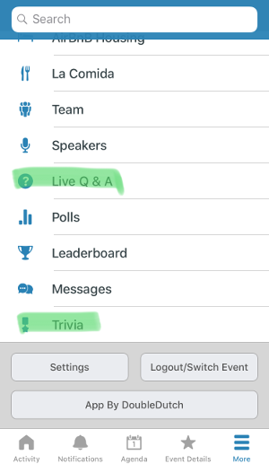
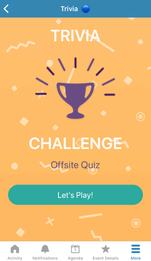

# DoubleDutch Developer Platform

## Frequently Asked Questions

### What is the DoubleDutch Developer Platform (DDDP)?

DDDP allows DoubleDutch customers and 3rd party developers to build extensions that can be
installed to any DoubleDutch event app.

### What is an extension?

An extension is a self-contained experience within a DoubleDutch app for attendees, possibly
with an administrator interface for Event Managers and Content Managers in the CMS.

In the app, attendees can navigate to extensions via the tab bar or "More" menu

Building extensions gives a high return on investment of development time, because they run on
both iOS and Android devices via the React Native framework.  Additionally, DDDP provides some
easy backend-as-a-service options.

### Can an extension access data from the rest of the app?

Extensions installed to an event have access to the same data that the rest of the app does, via
the same access token for that attendee in the current event.

### Can an extension access data from a third party API?

Yes, although it is the responsibility of that API to secure its data appropriately. Extensions
can make web requests to external systems.

### I have an idea for an extension...

Excellent! We have some questions for you:

1. Would the extension work as a separate app section that attendees can reach from the menu?
   If so, it may be a good candidate for a DDDP extension.
2. Would it require access to mobile device sensors like accelerometers, health data, AR/VR
   capabilities, or push messaging or require access to data from other apps?  If so, DDDP
   unfortunately does not support these functionalities at this time.
3. Would the extension need to store data in a backend?
   No problem! We have deep support for a zero-configuration data store in Firebase, with
   buckets of data protected within your events, and various access controls for attendees
   and Event Managers.
4. Do you have developers who can build it for you (with React Native and optionally Firebase Realtime Database skills)?
   - "Yes": Wonderful! Developers can get started [here, with videos and documentation](./index.md).
   - "No": That's okay!  Reach out to your DoubleDutch Customer Experience Manager or Account
     Manager for help in finding a contract developer who can build it.
